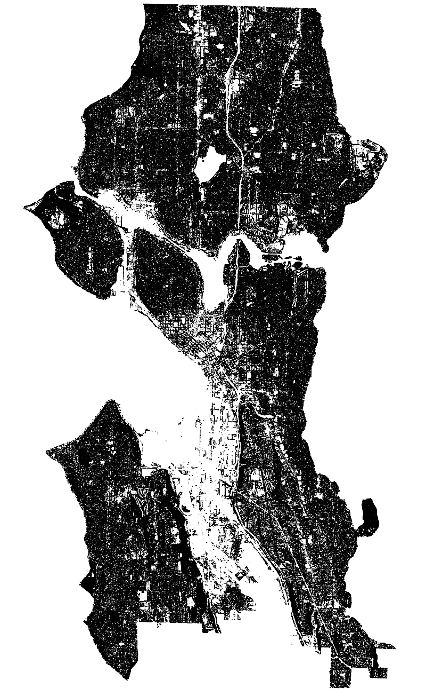
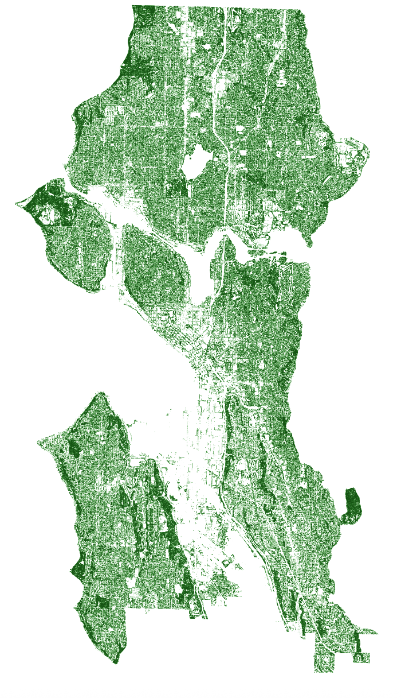

# Visual Relationship Between Housing Cost and Tree Canopy Coverage in Seattle, Washington

Final project for MAP 671 Fall 2025 by Ashley Grospitch

## Table of Contents

- [Project Background and Purpose](#project-background-and-purpose)
- [Data Source](#data-source)
- [Mapmaking Process](#mapmaking-process)
- [Map Summary](#map-summary)
- [Final Project Link](#final-project-link)

***

### Project Background and Purpose

This project aims to visually compare the relationship between housing cost and tree canopy coverage in Seattle, Washington. The hypothesized relationship is that areas with a higher density of tree canopy, demonstrated in increased color density, will be visually associated with areas of higher housing cost, represented by average cost per square foot. Completing this visual analysis will serve to identify if tree canopy density is associated with a higher cost of housing. While many factors influence housing costs, higher tree canopy has been shown to be associated with higher housing price (Lee & Thompson, 2024).

[For more information on the studied relationship between tree canopy and housing price, see this study conducted by Dr. Ryun Lee and Dr. Thomas Thompson.](https://doi.org/10.1080/19498276.2025.2461833)

### Data Sources

The two datasets used in this analysis come from the [Seattle Open Data Portal](https://data.seattle.gov/). The first dataset, ["Seattle Tree Canopy 2021"](https://data-seattlecitygis.opendata.arcgis.com/datasets/SeattleCityGIS::seattle-tree-canopy-2021/about) was used to show the locations of tree canopy across the metropolitan area, mapped in 2021 using remotely sensed data. The second dataset, ["Single-Family Home Sale Prices by Census Tract"](https://data-seattlecitygis.opendata.arcgis.com/datasets/SeattleCityGIS::single-family-home-sale-prices-by-census-tract/about), was used to show the average price per square foot by census tract. This dataset was specific to single-family homes, meaning the analysis is only applicable to this housing type. 

### Mapmaking Process

Initially, the goal of this project was to complete a spatial join of the two datasets and calculate the percent tree canopy coverage by census tract to more accurately determine the relationship between tree canopy coverage and housing price by square foot; however, the tree canopy dataset was so large that each geoprocessing tool took a long time to run, often crashing multiple times before completion, even after using the simplify and dissolve tools. Therefore, I decided to edit the symbology of the tree canopy layer to show density by rendering the layer using the feature multiply setting and visually compare density to housing price. I also edited the symbology of the housing price layer to create a color gradient that gets darker as housing price increased. 

The image below shows the tree canopy layer before and after editing the symbology, in which you are unable to determine density at all. By changing the color, opacity, and rendering, I was able to show tree canopy density.

Original symbology:

Final symbology:

Additionally, the original projection was in EPSG: 2926, which I also kept as the final projection because this is the projected coordinate system in feet for the north Washington area. 

### Map summary

Key findings from the map include that tree canopy does appear to be loosely correlated with housing cost. Parts of west Seattle have a higher tree canopy density and also a higher price per square foot. Areas of downtown have less tree canopy and a lower price per square foot despite being in the downtown cooridor. This initial analysis provides a start in determining the relationship between housing price and tree canopy density and would need additional analyses to determine a statistical relationship. 

Lessons from mapmaking include that symbology is a more powerful tool than I previously thought. As a data-oriented person, I thought it would be most informative for me to determine the percent tree canopy in each census tract and discounted the information that could be gathered through visual comparison. Additionally, in using such large files, I gained a deeper understanding of different data management options, such as saving files at geopackages rather than shapefiles to be able to export large file sizes. 

## Final Project Link

Please view the [final map online](https://github.com/amgr294/map-671-final-project-amgr294/blob/main/index.html). 
